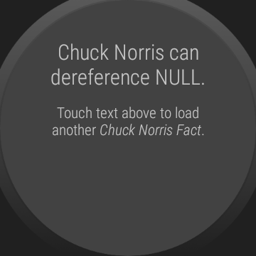
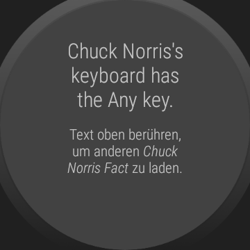

# WearOS-App: "Chuck Norris Facts"

Android-Studio-Project for a WearOS-App that fetches so called [*Chuck Norris Facts*](https://en.wikipedia.org/wiki/Chuck_Norris_facts) from the Web-API provided by
[*icndb.com (Internet Chuck Norris Database)*](http://www.icndb.com/api/).
The *Chuck Norris Facts* are in English, but the other display texts and the documentation of the source code are in German.

The author of this app is neither related to Chuck Norris nor to the developer/provider of [*icndb.com*](http://www.icndb.com).

----
## Screenshots

Screenshots were taken from emulator.

 

----
# License

See the [LICENSE file](LICENSE.md) for license rights and limitations (BSD 3-Clause License).