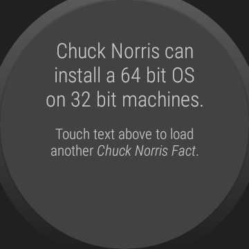

# WearOS-App: "Chuck Norris Facts"

Android-Studio-Project for a WearOS-App that fetches so called [*Chuck Norris Facts*](https://en.wikipedia.org/wiki/Chuck_Norris_facts) from the Web-API provided by
[*icndb.com (Internet Chuck Norris Database)*](http://www.icndb.com/api/).

The author of this app is neither related to Chuck Norris nor to the developer/provider of [*icndb.com*](http://www.icndb.com).

----
## Supported Languages

The *Chuck Norris Facts* and the display texts are available in English and German.

The JavaDoc comments and the names of most variables are German only. Further, the log messages
written using [*android.util.Log*](https://developer.android.com/reference/android/util/Log) are also in German.

----
## Screenshots

 

Screenshots were taken from emulator.

 

----
# License

See the [LICENSE file](LICENSE.md) for license rights and limitations (BSD 3-Clause License).
